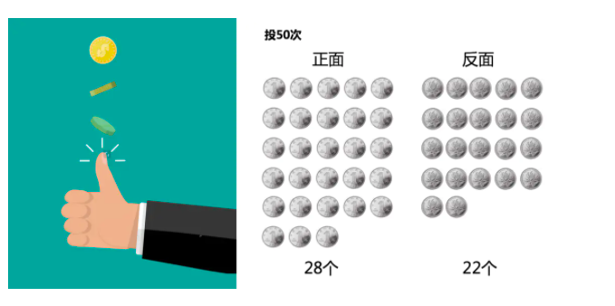
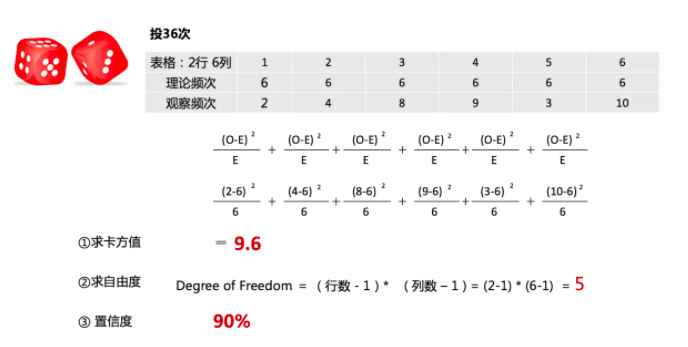
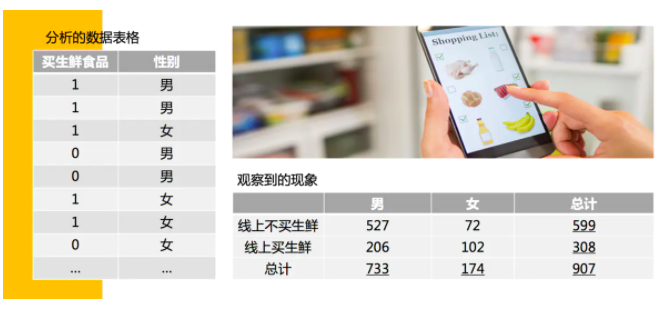
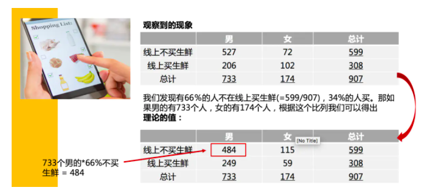
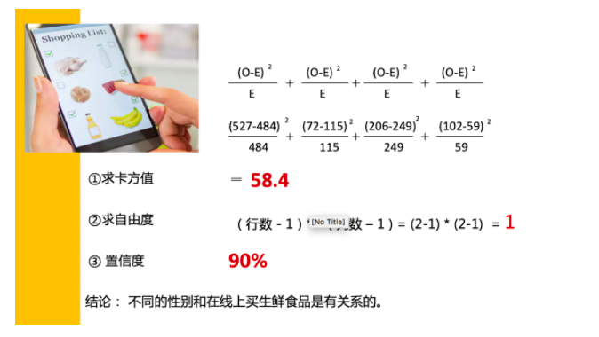

[TOC]

# 概念

卡方检验是统计 样本的实际观测值和理论推断值之间的偏离程度，实际观测值和理论推断值之间的偏离程度决定了卡方值的大小。如果卡方值越大，二者偏离程度越大; 反之，二者偏差越小; 如果两个值完全相等，卡方值就为0，表明理论值完全符合。

卡方检验的理论假设是：一个样本中已发生事件的次数分配会遵守某个特定的理论分配。通常的讲：观测频数跟实际频数应该没有区别，除非两个变量不是独立的。举个例子：XX公司不同部门职员的性别跟部门两者是独立的么？很明显不是哦。这儿我们的期望男女比例是1.05:1，但是在IT研发部分，比例可能是3:1，在HR、客服等部门，比率可能是1:3了。因此这儿的观测值就跟实际值不一致，我们就可以说两个不是独立的。

通常用卡方检验来检测两个变量或者样本的独立性。卡方检验只能对类别特征进行检验，对于连续型的特征，需要对其分段，离散化再计算卡方分布。

依据研究者设定的置信水准，查出自由度为 df 的卡方分配临界值，比较它与χ2统计值，推论能否拒绝虚无假设。如果计算出来的统计值大于表的值，则可以拒绝两个独立的假设，也就是说两者相关的，越相关χ2值越大。

从这儿可以看出， χ2比线性相关系数作用会广一些，因为它没有线性的前提假设。但是卡方检验时需要查卡方临界表，但是比较相关性大小就可以不用了。

# 实例

卡方检验是检验两个变量之间有没有关系。例如

> 卡方检验可以检验男性或者女性对线上买生鲜食品有没有区别;
>
> 不同城市级别的消费者对买SUV车有没有什么区别;

如果有显著区别的话，我们会考虑把这些变量放到模型或者分析里去。

## 投硬币

根据投硬币观察到的正面，反面次数，判断这个硬币是均衡的还是不均衡。现在有一个正常的硬币，我给你投50次，你觉得会出现几个正面，几个反面？

按照你的经验你会这么思考，最好的情况肯定是25个正面，25个反面，但是肯定不可能这么正正好好的，嗯，差不多28个正面，22个反面吧；23个正面，27个反面也可能的，但是10个正面，40个反面肯定不可能的，除非我运气真的那么碰巧。

你上面的这个思维方式，就是拿已经知道的结果(硬币是均衡的，没有人做过手脚)，推测出会出现的不同现象的次数。

而卡方检验是拿观察到的现象(投正面或反面的次数或者频数)，来判断这个结果(硬币是不是均衡的)。

继续上面这个例子，如果我不知道这个硬币是不是均衡的，我想用正面，反面的频次来判断，我投了50次，其中28个正面，22个反面。我怎么用卡方检验来证明这个硬币是均衡的还是不均衡的呢？

卡方检验的公式:

卡方值、自由度、置信度三个值的计算方法:

拿到这3个信息，去查表，因为0.72小于查表得到的3.841，所以我们得出这个硬币是均衡的结论。

## 投色子

有一个筛子，我不知道它是不是均衡的，于是我打算投36次看一下。

按照投硬币的方式，我先要画出一个表格，然后计算出3个数值:

带着这3个值，我们去查表，于是我们得出这个现象不能判定他是个均衡的筛子:

## 电商中消费者的性别和购买生鲜

我们要观察性别和在线上买不买生鲜食品有没有关系，现实生活中，女性通常去菜市场买菜的比较多，那么在线上是不是也这样。

我们得出观察到数据，并且形成表格后，我们需要计算理论的数据，在上面的例子我们发现，我们发现有66%的人不在线上买生鲜（599除以907），34%的人会在线上买。 那如果，男的有733个人，女的有174个人，根据这些比例，我们可以得出的理论值是什么呢？

# reference

[结合日常生活的例子，了解什么是卡方检验](https://www.jianshu.com/p/807b2c2bfd9b)
