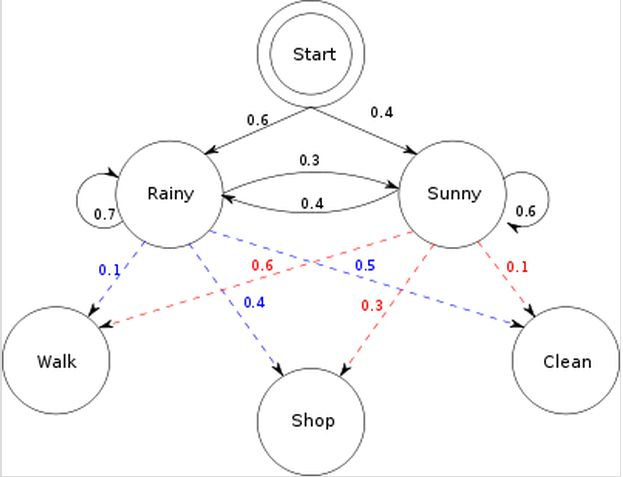

[TOC]

# 如何用简单易懂的例子解释隐马尔可夫模型？

在这里我们仍然使用非常简单的天气模型来做说明。

在这个马尔可夫模型中，存在三个状态，Sunny， Rainy， Cloudy，同时图片上标的是各个状态间的转移概率（如果不明白什么是转移概率，那建议先去学习什么是马尔可夫再来看HMM）。现在我们要说明什么是 HMM。既是隐形，说明这些状态是观测不到的，相应的，我们可以通过其他方式来『猜测』或是『推断』这些状态，这也是 HMM 需要解决的问题之一。举个例子，我女朋友现在在北京工作，而我还在法国读书。每天下班之后，她会根据天气情况有相应的活动：或是去商场购物，或是去公园散步，或是回家收拾房间。我们有时候会通电话，她会告诉我她这几天做了什么，而闲着没事的我呢，则要通过她的行为猜测这几天对应的天气最有可能是什么样子的。以上就是一个简单的 HMM，天气状况属于状态序列，而她的行为则属于观测序列。天气状况的转换是一个马尔可夫序列。而根据天气的不同，有相对应的概率产生不同的行为。在这里，为了简化，把天气情况简单归结为晴天和雨天两种情况。雨天，她选择去散步，购物，收拾的概率分别是0.1，0.4，0.5， 而如果是晴天，她选择去散步，购物，收拾的概率分别是0.6，0.3，0.1。而天气的转换情况如下：这一天下雨，则下一天依然下雨的概率是0.7，而转换成晴天的概率是0.3；这一天是晴天，则下一天依然是晴天的概率是0.6，而转换成雨天的概率是0.4. 同时还存在一个初始概率，也就是第一天下雨的概率是0.6， 晴天的概率是0.4.

根据以上的信息，我们得到了 HMM的一些基本要素：初始概率分布 π，状态转移矩阵 A，观测量的概率分布 B，同时有两个状态，三种可能的观测值。现在，重点是要了解并解决HMM 的三个问题。

- 问题1，已知整个模型，我女朋友告诉我，连续三天，她下班后做的事情分别是：散步，购物，收拾。那么，根据模型，计算产生这些行为的概率是多少。

- 问题2，同样知晓这个模型，同样是这三件事，我女朋友要我猜，这三天她下班后北京的天气是怎么样的。这三天怎么样的天气才最有可能让她做这样的事情。

- 问题3，最复杂的，我女朋友只告诉我这三天她分别做了这三件事，而其他什么信息我都没有。她要我建立一个模型，晴雨转换概率，第一天天气情况的概率分布，根据天气情况她选择做某事的概率分布。（惨绝人寰）而要解决这些问题，伟大的大师们分别找出了对应的算法。问题一，Forward Algorithm，向前算法，或者 Backward Algo，向后算法。 问题二，Viterbi Algo，维特比算法。问题三，Baum-Welch Algo，鲍姆-韦尔奇算法（中文好绕口）。尽管例子有些荒谬（天气情况要复杂的多，而且不太可能满足马尔可夫性质；同时，女朋友要做什么往往由心情决定而不由天气决定。而从问题一来看，一定是天数越多，这个概率就会越低；从问题三来看，观察到的行为越多，模型才能更准确一些），但是应该已经简单却又详尽地解释了什么是 HMM。如果只是想了解个大概，到此为止。

- 问题1的解决1：遍历算法。

要计算产生这一系列行为的概率，那我们把每一种天气情况下产生这些行为都罗列出来，那每种情况的和就是这个概率。有三天，每天有两种可能的天气情况，则总共有 2的三次=8种 情况.举例其中一种情况 ： P（下雨，下雨，下雨，散步，购物，收拾）=P（第一天下雨）P（第一天下雨去散步）P（第二天接着下雨）P（下雨去购物）P（第三天还下雨）P（下雨回家收拾）=0.6X0.1X0.7X0.4X0.7X0.5=0.00588当然，这里面的 P（第二天接着下雨）当然是已知第一天下雨的情况下，第二天下雨的概率，为0.7.将八种情况相加可得，三天的行为为{散步，购物，收拾}的可能性为0.033612. 看似简单易计算，但是一旦观察序列变长，计算量就会非常庞大（的复杂度，T 为观测序列的长度）。

- 问题1 的解决2：向前算法。

先计算 t=1时刻，发生『散步』一行为的概率，如果下雨，则为 P(散步，下雨)=P（第一天下雨）X P（散步 | 下雨）=0.6X0.1=0.06；晴天，P（散步，晴天）=0.4X0.6=0.24t=2 时刻，发生『购物』的概率，当然，这个概率可以从 t=1 时刻计算而来。如果t=2下雨，则 P（第一天散步，第二天购物， 第二天下雨）= 【P（第一天散步，第一天下雨）X P（第二天下雨 | 第一天下雨）+P（第一天散步，第一天晴天）X P(第二天下雨 | 第一天晴天)】X P（第二天购物 | 第二天下雨）=【0.06X0.7+0.24X0.3】X0.4=0.0552如果 t=2晴天，则 P（第一天散步，第二天购物，第二天晴天）=0.0486 （同理可得，请自行推理）如果 t=3，下雨，则 P（第一天散步，第二天购物，第三天收拾，第三天下雨）=【P（第一天散步，第二天购物，第二天下雨）X P（第三天下雨 | 第二天下雨）+ P（第一天散步，第二天购物，第二天天晴）X P（第三天下雨 | 第二天天晴）】X P（第三天收拾 | 第三天下雨）=【0.0552X0.7+0.0486X0.4】X0.5= 0.02904如果t=3，晴天，则 P（第一天散步，第二天购物，第三天收拾，第三天晴天）= 0.004572那么 P（第一天散步，第二天购物，第三天收拾），这一概率则是第三天，下雨和晴天两种情况的概率和。0.02904+0.004572=0.033612.以上例子可以看出，向前算法计算了每个时间点时，每个状态的发生观测序列的概率，看似繁杂，但在 T 变大时，复杂度会大大降低。

- 问题1的解决3：向后算法顾名思义，向前算法是在时间 t=1的时候，一步一步往前计算。

而相反的，向后算法则是倒退着，从最后一个状态开始，慢慢往后推。初始化： （第一次使用知乎的公式编辑，还蛮靠谱的嘛）递推：=0,.7x0.5x1+0.3x0.1x1=0.38其中第一项则是转移概率，第二天下雨转到第三天下雨的概率为0.7；第二项则是观测概率，第三天下雨的状况下，在家收拾的概率为0.5；第三项就是我们定义的向后变量（backward variable）。同理推得\beta_1(Rainy)=0.1298\\\beta_1(Sunny)=0.1076" eeimg="1">结束：P(散步，购物，收拾) ==0.6×0.1×0.1298+0.4×0.6×0.1076=0.033612 三种算法的答案是一致的。

- 问题2的解决：维特比算法维特比算法致力于寻找一条最佳路径，以便能最好地解释观测到的序列。

初始化：\delta_1(Sunny)=\pi_S\times b_S(O_1=Walk)=0.24" eeimg="1">初始路径：\phi_1(Sunny)=0" eeimg="1">递推，当然是要找出概率比较大的那条路径。那么，到达第二天下雨这一状态的最佳路径，应该是：也就是说，第一天是晴天的可能性更大。同样地，可以推得，\phi_2(Sunny)=Sunny\\\delta_3(Rainy)=0.01344\\\phi_3(Rainy)=Rainy\\\delta_3(Sunny)=0.002592\\\phi_3(Sunny)=Sunny" eeimg="1"> 结束：比较 的大小，发现前者较大，则最后一天的状态最有可能是 下雨天。回推：根据 可知，到达第三天下雨这一状态，最有可能是第二天也下雨，再根据可知，到达第二天下雨这一状态，最有可能是第一天是晴天。由此，我们得到了最佳路径，即，晴天，雨天，雨天。

- 问题3的解决：Baum-Welch 算法。此问题的复杂度要远远高于前两种算法，不是简单解释就能说的清楚的了。若有兴趣，可以私信我。我非常赞同霍金老头的『多一个公式，少十个读者』的说法，但是自己写起来，却发现用英文的这些公式好像比中文更简洁易懂，中文好像更罗里吧嗦一些。

# HMM解决的三个问题

## 概率计算问题

## 

# 应用场景

- 研究问题是基于序列的，比如时间序列或者状态序列

# reference

[如何用简单易懂的例子解释隐马尔可夫模型？](https://www.zhihu.com/question/20962240)

[用隐马尔科夫模型来预测股价走势](https://blog.csdn.net/qq_39241986/article/details/108138664)

[Example: Hidden Markov Models](https://pyro.ai/examples/hmm.html)
