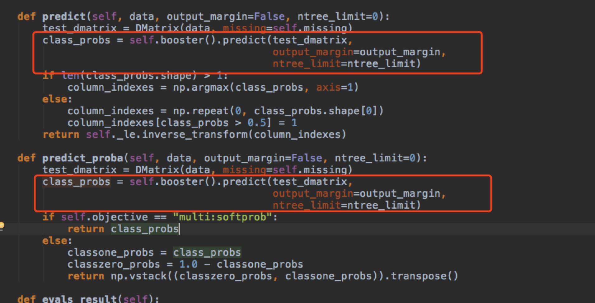

# svm 是否可以输出概率值

```bash

https://blog.csdn.net/funny75/article/details/50154391
https://blog.csdn.net/iichangle/article/details/46817999

```

> 对标准输出结果计算后验概率的值


# xgboost  predict 中的 结果的 01值是如何确定的

```bash
eval_preds = self.model.predict(eval_fs)
eval_preds_prob = self.model.predict_proba(eval_fs)[:,1]

```




# L0, L1, L2 范数

```bash
https://blog.csdn.net/zchang81/article/details/70208061 (深度学习——L0、L1及L2范数)

```

# xgb 原理


# 建设模型是线性回归，不小心多增加了一列重复特征，使用L1和L2优化有什么不同？

> https://stats.stackexchange.com/questions/241471/if-multi-collinearity-is-high-would-lasso-coefficients-shrink-to-0

# 特征离散话的收益和风险

```bash
# 收益


# 风险
1. 内部信息没有了
比如年龄离散化，可能21，22两个信息放到了一起

```

# 样本不平衡问题

# 偏差，方差，在过拟合时，方差/偏差怎样表现？

# xgb生成组合特征和fm有何区别？

> xgb 不能学到训练数据里面不存在的逻辑关系

> fm 为什么可以？


# 算法优化除了SGD外，还用过什么

```bash
adam

```

# 归一化/标准化的目的


# CNN能够解决的问题有什么样的？

# AUC的物理含义？为什么越大越好？

```bash
1. 即使AUC很低，也是好的
2. 不平衡样本的时候AUC的指标依然是稳定的
3. 正例排在负例的前面

```

# 基尼系数


# 特征有1600维 如何确定xgboost 的树的数量


# 昨天360面试，被问了一个之前从来没有问过的问题，fm，ffm，xgboost这些算法的复杂度都是多少


