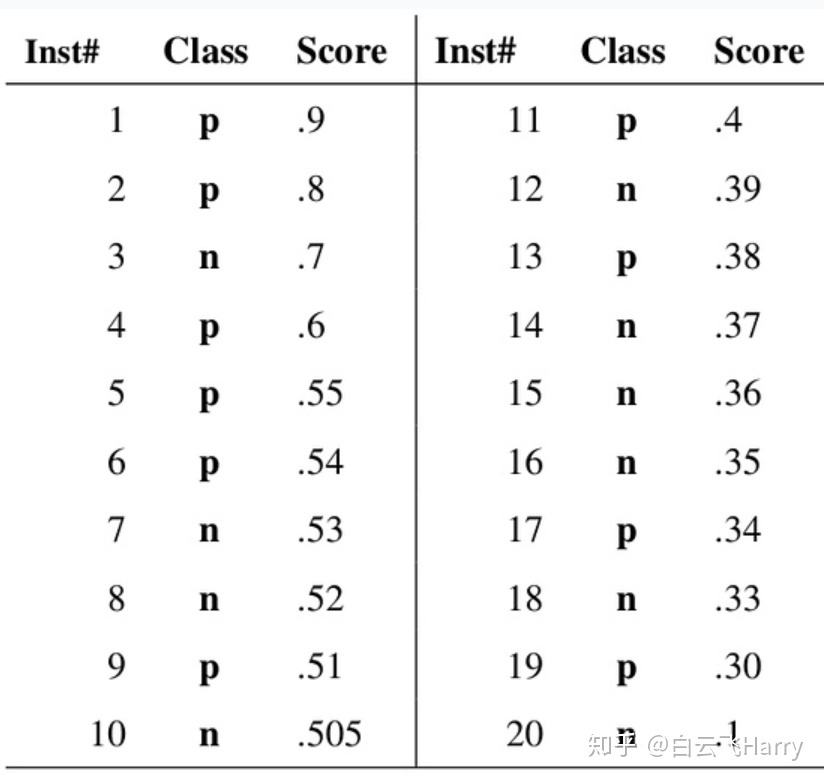
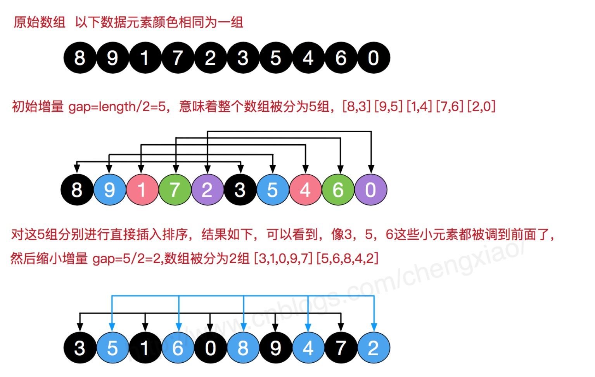
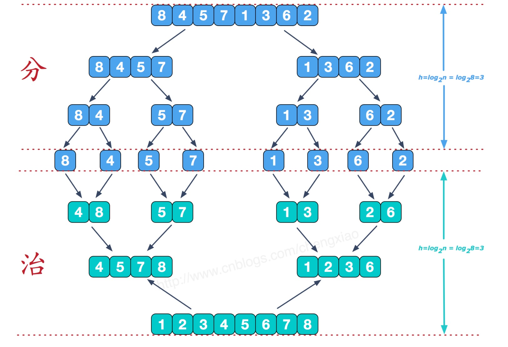
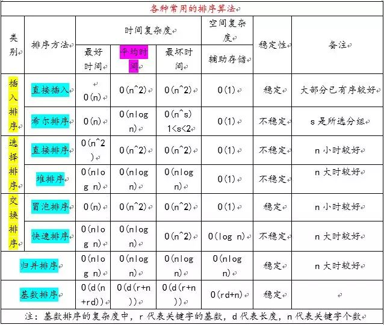

[TOC]


# 机器学习面试考察的几个方面

## 算法和理论基础
统计学习的核心步骤：模型、策略、算法，你应当对logistic、SVM、决策树、KNN及各种聚类方法有深刻的理解。能够随手写出这些算法的核心递归步的伪代码以及他们优化的函数表达式和对偶问题形式。 非统计学习我不太懂，做过复杂网络，但是这个比较深，面试可能很难考到。 数学知识方面，你应当深刻理解矩阵的各种变换，尤其是特征值相关的知识。 算法方面：你应当深刻理解常用的优化方法：梯度下降、牛顿法、各种随机搜索算法（基因、蚁群等等），深刻理解的意思是你要知道梯度下降是用平面来逼近局部，牛顿法是用曲面逼近局部等等

lr，svm，pr曲线，朴素贝叶斯的assumption，ensemble方法，决策树节点用哪个特征进行划分，gbdt原理，random forest原理，pca和lda降维原理，写k means和gmm公式，特征选择的方法有哪些，cnn与rnn的区别，你所知道的距离度量方式，你所知道的loss function，蓄水池抽样

推荐系统的算法中最近邻和矩阵分解各自适用场景

数据不平衡问题和时间序列分析

对于机器学习的整体理解：过拟合 vs. 欠拟合，偏差 vs. 方差
常见的模型评估指标：precision、recall、confusion matrix、AUC、KS、PSI
正则化：Ridge vs. LASSO，L1范数和L2范数，几何空间上的解释
损失函数：最小二乘法，极大似然法，两者的相互转化
集成学习建模能力：GBDT、Xgboost、LightGBM、Stacking
深度学习建模能力：BP、CNN、RNN、强化学习
数学知识：矩阵分解，贝叶斯，梯度下降

> 比如样本不平衡问题，负样本如何挑选等问题


> 建模经验

2. 建模项目全流程阐述？（考察对于建模项目全流程的理解）

确定模型目标 --> 数据源调研 --> 数据预处理 --> 特征工程 --> 特征筛选 --> 模型训练 --> 模型评估 --> 模型上线 --> 模型监控 --> 模型优化
3. 模型目标Y如何确定？（将业务问题转化为数学问题的能力）

正负样本的含义
Y的稳定性和合理性
正负样本不均衡问题：过采样，欠采样，集成学习
4. 特征工程与特征筛选？（特征工程的能力）

除了离散化、交叉项、one-hot encoder等常规方法，列举其他特别的或者基于行业经验的特征工程方法，比如利用gbdt叶子结点构造特征
除了相关性、共线性、模型筛选等，列举其他特征筛选方法，比如计算特征PSI等
5. 模型技术选型？（选择最合适模型算法的能力）

如何基于实际场景选择最合适的模型算法，模型的优缺点以及前提假设
如何设计集成模型结构并搭建
如何在模型的高效性与准确性之间取舍
如何完成模型上线与监控


. 深度学习？（对于前沿技术的了解以及落地能力）

深度学习在金融科技中的落地场景
如何提高深度学习的可解释性
如何评估深度学习算法的落地效果


### 降维

> Q: You are given a train data set having 1000 columns and 1 million rows. The data set is based on a classification problem. Your manager has asked you to reduce the dimension of this data so that model computation time can be reduced. Your machine has memory constraints. What would you do? (You are free to make practical assumptions.)

> A: (1) 对数据进行抽样	（2）根据对业务的理解，去掉线性相关性的变量	（3）使用PCA降维	（4）在线学习	（5）mini-batch 梯度下降学习

### 数据不平衡问题

> Q:You are given a data set on cancer detection. You’ve build a classification model and achieved an accuracy of 96%. Why shouldn’t you be happy with your model performance? What can you do about it?

> A: 在训练样本不均衡的情况下，使用准确率不能很好的评估效果。比如正样本只有4%，而负样本有96%，因此我们可以使用如下方法进行性能评估

> (1) 首先看是否可以扩大数据集

>（2）尝试采样或者集成训练的方式。通过下采样、上采样、SMOTE(Synthetic Minority Oversampling Technique)即合成少数类采样技术。欠采样：若随机丢弃反例，可能丢失一些重要信息，周志华实验室提出了采用集成学习机制，将反例划分为若干个集合供不同的学习器使用，这样对每个学习器来看都进行了欠采样，但全局来看却不会丢失重要信息。

>（3）尝试人工产生数据样本

>（4）更改评估指标：比如用AUC-ROC来进行评估效果

>（5）可以给少数的正类以更大的权重

> （6）将分类问题转换为异常点检测问题，即对那些罕见的事件进行识别。

### 线性回归和决策树问题

> Q: You are working on a time series data set. You manager has asked you to build a high accuracy model. You start with the decision tree algorithm, since you know it works fairly well on all kinds of data. Later, you tried a time series regression model and got higher accuracy than decision tree model. Can this happen? Why?

> A:时间序列数据具有线性特性，而决策树是解决非线性的相互作用的最佳方法。决策树不能稳健的预测是因为不能像回归模型那样很好的映射线性关系。因此，在数据满足线性假设的情况下，线性回归模型可以提供稳健的鲁棒预测。

### 组合模型前提假设

> Q: After spending several hours, you are now anxious to build a high accuracy model. As a result, you build 5 GBM models, thinking a boosting algorithm would do the magic. Unfortunately, neither of models could perform better than benchmark score. Finally, you decided to combine those models. Though, ensembled models are known to return high accuracy, but you are unfortunate. Where did you miss?

> A: 组合模型有效果的前提是，每个若分类器都是不相关的。在题中，有5GBM models，因此可以肯定这些模型都是高度相关的。

### 随机森林和GBDT比较

> 相同点

> 1. 都是由多棵树组成
> 
> 2. 最终的结果都有多棵树一起决定
> 
> 不同点
> 
> 1. 组成随机森林的树可以是分类树也可以是回归树，但GBDT只能是回归树
> 
> 2. 随机森林的树能够并行生成，GBDT只能串行生成
> 
> 3. 结果，随机森林通过投票方式决定；GBDT将所有结果累加起来，采用梯度提升的方式决定
> 
> 4. 异常值：随机森林不敏感；GBDT对异常值敏感
> 
> 5. 随机森林通过减少方差提升性能；GBDT通过减少模型偏差提升性能

### 特征选择的工程化方法

[线性相关系数、卡方检验、互信息](https://blog.csdn.net/gdanskamir/article/details/54913233)

[关于相关系数的一些理解误区](https://blog.csdn.net/witforeveryang/article/details/42585791)

[Correlation](https://www.mathsisfun.com/data/correlation.html)

[用可视化思维解读统计自由度](https://www.jianshu.com/p/0032087b9dbb)

[结合日常生活的例子，了解什么是卡方检验](https://www.jianshu.com/p/807b2c2bfd9b)

#### 计算每一个特征与响应变量的相关性

##### 线性相关系数

> 线性相关系数前提是必须建立在因变量和自变量是线性关系的基础上，否则线性相关系数是没有意义的。例如：非线性相关也会导致相关系数较大；离群点也会导致相关系数较大

> 只有当两个变量的标准差都不为0时，相关系数才有意义

> 相关系数等于0，只能说明两个变量不是线性关系，但不能说明两个变量之间没有关系，比如非线性关系。

> 从公式中可以看出，如果只有一个数据，分母为0，线性相关系数也是没有意义的

> 少量数据，计算相关性也是无意的(无法画出那条直线)

> 在给出相关系数之前，画图展示下数据的分布

##### 卡方检验(chi-square test)

> 用来检测两个变量或样本的独立性。卡方检验的理论假设是：观测频数和实际频数没有区别，除非两个变量不是独立的。例如：XX公司不同部门职员的性别和部门两者是独立的嘛？很明显不是，部门1期望男女比例是1.05:1，IT 研发部门可能是3:1， HR, 客户等部门可能是1:3了

> 没有线性的前提假设，但卡法检验需要查询卡方临界表，但是比较相关性大小就不用了 

> 对于连续性的特征，需要离散化在计算卡方分布

> 计算卡方的步骤： （1）计算卡方统计值   （2）计算自由度	（3）确定置信水平

##### 互信息

> 互信息是变量间相互依赖性的度量，简单来讲，是指一个随机变量包含另外一个随机变量的信息量，或者说如果已知一个变量，另外一个变量较少的信息量

> 当且仅当X和Y为独立随机变量时，互信息值为0

> 互信息是对偶的

> 互信息是非负的

> 连续性的特征也需要离散化处理

#### 构建单个特征模型，通过模型的准确性为特征排序，借此选择特征

#### 通过L1正则选择特征

> L1正则具有稀疏解的特性。L1没有选择的特征不代表不重要，原因是两个具有高度相关性的特征可能只保留了一个，如果要确定那个特征更重要需要通过L2正则

#### 训练能够对特征打分的预测模型

> RandomForest和Logistic Regression都是能对模型特征打分 

#### 通过特征组合 

#### 通过深度学习来进行特征选择

> 例如计算机视觉，原因是深度学习具有自动学习特征的能力

### 特征比数据量还大时，应选择什么样的分类器？

> 训练集很小，应选择高偏差/低方差分类器(比如朴素贝叶斯分类器)要优于低偏差/高方差分类器(如K近邻)

> 随着训练集的增大，低偏差/高方差分类器将开始胜出


### ROC、AUC曲线

> ROC(receiver operating characteristic curve) 受试者工作特征曲线，又称感受性曲线，反映的是受统一信号刺激时，采用不同的判定标准下所得的结果。横坐标为FPR，纵坐标为TPR，ROC曲线的下的面积即为AUC的值。
> AUC=0.5，说明和随机值的效果等同；AUC > 0.9 具有较高的准确性

> ROC 曲线特性： 当测试集中的正负样本不均衡时，ROC曲线能够保持不变

> 绘制ROC曲线：（1）如下图，根据所有样本的输出概率(属于正样本的概率)，将概率值从大到小排序，确定不同的"discrimination threashold"，即可得到多组FRP、TPR的坐标值，然后绘制成曲线   （2）例如：score 选择为0.6，则1，2，3，4被认为是正样本，其他的则都认为负样本

> 

### bagging 和boosting的区别

> 训练集：bagging的训练集的选择是随机的，各轮训练集之间相互独立；boosting的训练集的选择是独立的，各轮训练集的选择和前面各轮的学习结果有关

> bagging各个预测模型是没有权重的；而boosting是有权重的 

> bagging各个预测模型可以并行训练；而boosting只能顺序生成

### 多重共线性问题

[机器学习线性回归：谈谈多重共线性问题及相关算法](https://blog.csdn.net/xo3ylAF9kGs/article/details/78623269)

[机器学习之线性回归：OLS 无偏估计及相关性python分析](https://mp.weixin.qq.com/s?__biz=MzI3NTkyMjA4NA==&mid=2247484105&idx=1&sn=15ecda642332a31809b4a41bf5375aa2&chksm=eb7c2f02dc0ba6141706c7c9b50066733b96fb50f912c1f32f6cd209b33dee614e1e10da9d71&scene=21#wechat_redirect)

[从统计看机器学习(一) 一元线性回归](http://www.cnblogs.com/miluroe/p/5350154.html)

[多重共线性的解决方法之——岭回归与LASSO](http://www.mamicode.com/info-detail-1146481.html)

[从统计看机器学习(二) 多重共线性的一些思考](https://blog.csdn.net/three_bird/article/details/51336817)

> 最小二乘法，一致的看待每一个样本点，是典型的无偏估计，会得到一个使得残差最小的权重参数。

> 多重共线性: 是指在线性回归模型中，自变量之间存在相关关系，这会使得模型的权重参数估计失真或者难以估计准确的一种特性，例如一件商品的销售量可能与当地的人均收入和当地的人口这两个因素存在相关关系，可以使用线性相关系数来判断。(最小二乘法会对样本点的误差极为敏感，最终回归后的权重参数方差变大)。解决的思想是放弃无偏估计，损失一定精度，对数据进行有偏估计，例如使用LASSO和岭回归方法

> 添加正则项解决共线性。正则项在机器学习中，一方面可以解决过拟合；另一方面也可以解决上面提到的这种病态矩阵。

> LASSO采用L1正则的方式。会使共线性的特征权重只保留一个，其他都为0

> 岭回归采用L2正则的方式。不会使得每个特征权重都为0，但都会接近于0

### GBDT 调参经验

[GBDT参数调优](https://blog.csdn.net/hhy518518/article/details/54947880)

[scikit-learn 梯度提升树(GBDT)调参小结](http://www.cnblogs.com/pinard/p/6143927.html)

> 首先确定步长和迭代次数

> 然后对决策树进行调参：决策树最大深度、内部结点再划分所需要的最小样本数、最大特征数、采样率等

> 最后再调整步长和迭代次数

### 各种算法优缺点及使用场景

#### 神经网络

> 优点：很强的非线性表达能力和鲁棒性； 并行性好； 自学能力、误差反向传播

> 缺点：推理及依据解释性差； 需要大规模数据

#### SVM

> 特点：将低维空间映射到高伟空间，实现线性可分

> 优点：可用于分类和回归； 适用于小样本数据

> 缺点：对核函数以及参数敏感

[支持向量机通俗导论（理解SVM的三层境界）](https://blog.csdn.net/v_july_v/article/details/7624837)

#### 朴素贝叶斯

> 特点：使用先验知识得到后验概率

> 优点：小规模数据表现好； 适用于多分类

> 缺点：需要条件独立假设，会牺牲一定准确率

#### 线性回归

> 特点： 可以得到解析解

> 优点： 简单，存在解析解

> 缺点：对复杂数据容易欠拟合

#### KNN

> 特点：不用训练； 三要素：k 值选择，距离度量，投票决策

> 优点：分类/回归均可； 可适用于非线性

> 缺点：k值需要预先设定； 对大小不平衡数据易偏向大容量数据的类别

#### 聚类

> 优点：简单； 非监督学习

> 缺点：对簇值选择有要求

####决策树

> 特点： 适用于小规模数据

> 优点：计算简单； 可结实性强； 比较适用于有缺失属性的样本； 能够处理不相关特征 

> 缺点：容易过拟合(可用剪枝来避免)

[从决策树学习谈到贝叶斯分类算法、EM、HMM](https://blog.csdn.net/v_july_v/article/details/7577684)

### 用户画像构建

[浅谈用户画像构建](https://zhuanlan.zhihu.com/p/27126412)

#### 目标: 构建用户静态/动态数据

##### 静态数据-评估价值

> 人口属性：性别、年龄、地域等

> 商业属性：收入、职业、所属行业

> 消费属性：汽车购买、房屋购买

> CRM：会员价值

##### 动态数据-循迹

> 场景：访问设备、访问时段

> 媒体： 访问页面、访问时长、访问频次

> 路径： 流量来源、流量去向

#### 形态：标签和权重

> 标签：表征了内容，用户对该类内容的兴趣、偏好、需求等

> 权重：表征指数，用户的兴趣、偏好指数

#### 数据建模方法： 标签= 用户标识 + 时间 + 行为类型 + 接触点(网址+内容)的聚合

### [百面机器学习--Hulu](https://www.jianshu.com/p/576595f9a16b)

### 余弦距离和欧式距离比较

> 余弦相似度关注的是两个向量之间的角度关系，并不关心他们的绝对大小，取值范围为[-1, 1]。

> 欧式距离的数值受到维度的影响，范围不固定

### 注意力机制

> 生物体的注意力机制：通过视觉和听觉不断的获取带有序列的声音和图像信号，并交由大脑理解。注意力机制就是在模仿人在生成序列时的行为，当解码序列的某个输出时，重点关注输入序列和当前位置的输出相关的部分，从而缓解Seq2seq模型的上述问题

> 例如在机器翻译中，使用seq2seq模型，通常会使用RNN作为编码器，将输入序列编码成为一个向量表示。但在实际使用中，会发现随着序列的增长，模型的性能发生了明显下降。这是因为编码时将输入序列的全部信息压缩到一个向量中，随着序列增长，句子前面的词的信息丢失严重。

> 因此，注意力机制是一种解决梯度消失的一种方案

### 集成学习是否可以使用线性分类器或者k-近邻

> 最常用的基分类器是决策树： （1）决策树可以很方便的将样本的权重整合到训练过程中，而不需要使用采样的方式来调整样本权重 （2）决策树的表达能力和泛化能力，可以通过调节树的层数来做折中

> 随机森林是属于bagging类的集成学习。bagging的主要好处是集成后的分类器方差要比基分类器的方差小。因此bagging所采用的基分类器，最好是本身对样本分布比较敏感。

> 线性分类器/k-近邻是比较稳定的分类器，本身方差就不大，所以，以它们作为基分类器使用bagging并不能在原有基分类器的基础上上，获得更好的表现。甚至，可能因为bagging的采样，而导致它们在训练过程中更难收敛，而增大了集成分类器的偏差。  

### BN

> 神经网络训练过程的本质：是学习数据分布，训练数据与测试数据的分布不同将大大降低网络的泛化能力，因此在训练开始前对输入数据进行归一化处理

> 随着神经网络训练的进行，每个隐藏层的参数变化使得厚一层的输入发生变化，从而每一批训练数据的分布也随之变化，致使网络在每次迭代中都需要拟合不同的数据分布，增大了训练的复杂度和过拟合风险。

> BN是针对每一批数据，在网络的每一层输入之前，增加归一化处理

### 常用的计算距离的方法

> 欧式距离

> 余弦距离

> 曼哈顿距离

> 切比雪夫距离  

> 马氏距离

### xgboost 特征
```bash
四级品类
价格
品牌
商城
是否单品
是否优惠券
频道
地域
是否精选
历史曝光次数
打赏次数
创建时间
发布时间
diff=创建时间-发布时间
值比率=值/（值+不值）
```

### 机器学习中如何利用ID类特征

#### ID类特征为什么有效

> ID类特征的价值

> （1）可以在学习过程中，每个人ID类特征能够合理的影响到整体模型，使得整体泛化能力更好。即加入ID类型的特征，可以把每个用户的行为模式区分开，从而提高其他特征的泛化能力。例如： “对抗热度穿透现象”。假设一个最简单的问题，预估广告的点击率CTR。为了便于讨论，假设你只有一个特征，就是每次展现广告在过去一个时间窗内的历史点击率ctr，现在目标是预测下一次点击的ctr。简单起见，不妨假设系统中只有两条候选广告。显而易见，预测分数是和ctr正相关的。如果你使用的是离散LR，那么在分段之后，显然ctr越高的分段上权重越大。这个模型实际跑起来就是最简单的“热门广告”的效果。现在你加入了一个新的特征，叫做设备id（更理想的情况当然是用户id）。那么你会发现，对于不同的用户id，也许能学出来一些权重。但是模型打分的排序应该基本是不变的。那么你会问：那这特征加进来有蛋用？当然有，假设最极端的情况，整个广告系统只有2个设备，一个设备属于普通用户，一个设备属于一个恶意的刷子（他专门用脚本点击某个广告以使得这条广告有更高几率被浮现）。那么由于普通用户他看到广告后实际点击率是比刷子低的。那么模型就学到了：导致广告更高点击率的原因其实是用户id。那么经过机器学习之后，刷子这个id的权重就高了，而ctr的权重就低了。那么相对来讲，尽管每个人看到的排序是一样的，但是其中刷子的刷分行为效果就被大大降低了。

> (2) 可以使模型对每个ID都有更细粒度的排序能力，使得模型的个性化效果更好。

#### ID类特征该如何使用

> (1) ID类型的特征非常的稀疏，这意味着需要更大量的数据，但一定要通过正则的方法来限制ID类特征过拟合。在广告、推荐系统这种场景中，单个ID上收集到的信息非常多。

> (2) ID类特征在预测过程中的命中率可能不高，但可以通过分层的方式，由最细粒度到最粗粒度的特征搭配来保证特征的命中率。比如，用户ID-> 用户GPS坐标 + 用户喜好tag + 用户最近的行为 -> 用户年龄、性别。

> (3) 特征组合。单独的ID类特征意义没有那么高，有意义的是不同层次的交叉组合，这取决于业务理解和特征工程的手法。

>（4）模型和算法。LR适合使用ID类特征，因为LR适合接受高纬度的特征输入； 对于xgboost、dnn，在工程和算法上都有挑战，针对这种高纬度特征可是经过Embedding后再灌入。


GBDT的原理 （理论基础）决策树节点分裂时如何选择特征，写出Gini index和Information Gain的公式并举例说明（理论基础）感谢 @Towser 等同学的纠错分类树和回归树的区别是什么？（理论基础）与Random Forest作比较，并以此介绍什么是模型的Bias和Variance（理论基础）XGBoost的参数调优有哪些经验（工程能力）XGBoost的正则化是如何实现的（工程能力）XGBoost的并行化部分是如何实现的（工程能力）为什么预测股票涨跌一般都会出现严重的过拟合现象（业务理解）针对这个问题有同学觉得没什么太多好讲的，我在评论里给了我的理解，我不是做这块的，可能比较浅显，大家理解一下面试官的意图就好。如果选用一种其他的模型替代XGBoost，你会选用什么？（业务理解和知识面）


### svm 是否可以输出概率值

```bash

https://blog.csdn.net/funny75/article/details/50154391
https://blog.csdn.net/iichangle/article/details/46817999

```

> 对标准输出结果计算后验概率的值

### svm 调参经验

[SVM 调参策略](https://blog.csdn.net/u014484783/article/details/78220646)

#### svm 调参步骤

1. 对数据做归一化（simple scaling） 
2. 应用 RBF kernel 
3. 用cross-validation和grid-search 得到最优的c和g 
4. 用得到的最优c和g训练训练数据 
5. 测试

#### 不同的核函数选择不同的调参策略
C一般可以选择为：10^t , t=[- 4，4]就是0.0001 到10000。选择的越大，表示对错误例惩罚程度越大，可能会导致模型过拟合

- 线性核函数 

（无其他参数） 

- 多项式核函数 

（重点是阶数的选择，即d，一般选择1-11：1 3 5 7 9 11，也可以选择2,4，6…） 

- RBF核函数 

（径向基RBF内核，exp{-|xi-xj|^2/均方差}，其中均方差反映了数据波动的大小。gamma参数通常可选择下面几个数的倒数：0.1 0.2 0.4 0.6 0.8 1.6 3.2 6.4 12.8，默认的是类别数的倒数，即1/k，2分类的话就是0.5） 

- sigmoid核函数 又叫做S形内核 

两个参数g以及r：g一般可选1 2 3 4，r选0.2 0.4 0.6 0.8 1 

- 自定义核函数

1）对于线性核函数，没有专门需要设置的参数 

2）对于多项式核函数，有三个参数。-d用来设置多项式核函数的最高此项次数，也就是公式中的d，默认值是3。-g用来设置核函数中的gamma参数设置，也就是公式中的第一个r(gamma)，默认值是1/k（k是类别数）。-r用来设置核函数中的coef0，也就是公式中的第二个r，默认值是0。 

3）对于RBF核函数，有一个参数。-g用来设置核函数中的gamma参数设置，也就是公式中的第一个r(gamma)，默认值是1/k（k是类别数）。 

4）对于sigmoid核函数，有两个参数。-g用来设置核函数中的gamma参数设置，也就是公式中的第一个r(gamma)，默认值是1/k（k是类别数）。-r用来设置核函数中的coef0，也就是公式中的第二个r，默认值是0。

#### cost(惩罚项)和gamma(支持向量个数)参数

- C是惩罚系数  

即对误差的宽容度。c越高，说明越不能容忍出现误差,容易过拟合。C越小，容易欠拟合。C过大或过小，泛化能力变差

- gamma是选择RBF函数作为kernel后，该函数自带的一个参数。

隐含地决定了数据映射到新的特征空间后的分布，gamma越大，支持向量越少，gamma值越小，支持向量越多。支持向量的个数影响训练与预测的速度。


### xgboost  predict 中的 结果的 01值是如何确定的

```bash
eval_preds = self.model.predict(eval_fs)
eval_preds_prob = self.model.predict_proba(eval_fs)[:,1]

```


### L0, L1, L2 范数

```bash
https://blog.csdn.net/zchang81/article/details/70208061 (深度学习——L0、L1及L2范数)

```

### xgb 原理


### 建设模型是线性回归，不小心多增加了一列重复特征，使用L1和L2优化有什么不同？

> https://stats.stackexchange.com/questions/241471/if-multi-collinearity-is-high-would-lasso-coefficients-shrink-to-0

### 特征离散话的收益和风险

```bash
# 收益


# 风险
1. 内部信息没有了
比如年龄离散化，可能21，22两个信息放到了一起

```

### 样本不平衡问题

### 偏差，方差，在过拟合时，方差/偏差怎样表现？

### xgb生成组合特征和fm有何区别？

> xgb 不能学到训练数据里面不存在的逻辑关系

> fm 为什么可以？


### 算法优化除了SGD外，还用过什么

```bash
adam

```

### 归一化/标准化的目的


### CNN能够解决的问题有什么样的？

### AUC的物理含义？为什么越大越好？

```bash
1. 即使AUC很低，也是好的
2. 不平衡样本的时候AUC的指标依然是稳定的
3. 正例排在负例的前面

```

### 基尼系数


### 特征有1600维 如何确定xgboost 的树的数量


### 昨天360面试，被问了一个之前从来没有问过的问题，fm，ffm，xgboost这些算法的复杂度都是多少


## 工程实现能力和编码水平

背包问题，lcs，lis，编辑距离，最长回文子串等dp问题；链表反转，递归和非递归解法，判断是否有环等链表问题；树的前序，中序，后序遍历，判断镜像，判断是否是完全二叉树或者满二叉树，求树的深度，lca等树的问题；快排，堆排序，归并排序，最大k个数，时间复杂度等排序问题；实现atoi等等

## 业务理解和思考深度


# 自我介绍的时候突出自己的优势
 面试重点考察：项目的难度和求职者对项目的主要贡献
优秀面试者特质 （1）基本功扎实 （2）能够很好的了解面试官考察的内容
简历： （1）精准描述项目的难点，并且包含准确的评价数据  （2）对面试官的问题精确回答，不要做过多的辩解
算法笔试 ： （1）先复述一下面试题，确保问题理解正确  （2）要保持和面试官的交流，当成未来的团队的成员，先给出一个可运行的版本然后在讨论其他的改进方案，切记闷头答题

# 快速迭代自己的技能树

# 数学

## 电线问题

有101根电线 每根的一头在楼底  另一端在楼顶  有一个灯泡 一个电池 无数根很短的电线  怎么样在楼上一次在楼下去一次将电线的对应关系弄清楚

https://www.nowcoder.com/questionTerminal/8fbe914653ea4a769f047e005a4448c6

https://blog.csdn.net/WitsMakeMen/article/details/22215703

# 概率论

## 偏态分布下众数、均值、中位数大小关系

偏态分布：是指频数分布不对称，集中偏向一侧，按着尾部来区分左偏还是右偏。

右偏分布：尾部向右延伸，峰值左移(集中位置偏向数值小的一侧)。 其中 众数 < 中位数 < 均值。中位数仅与样本的总数有关系，即在整个样本(从小到大排序后)的中间位置， 而在右偏分布中，大部分值都在峰值(众数)的右边，因此中位数在众数的右边(众数 < 中位数)；由于均值受极大值的影响变大，而中位数不受影响，因此均值大于中位数(中位数 < 均值)。
例如收入的分布就是一个右偏分布，穷人永远是大多数(众数是一个很低的数字), 中产阶级收入高一些(中位数比众数大), 被富人平均后，大家收入看起来很可观(均值很大)。

左偏分布：尾部向左延伸，峰值右移(集中位置偏向数值大的一侧)。 其中 均值 < 中位数 < 众数。 例如，死亡年龄就是一个左偏分布，年龄越大的死亡概率是大多数(众数是一个很高的数字), 青年死亡概率会小一些(中位数比众数小), 被小孩子一平均后，死亡年龄下降(均值很小)。

# 数据结构

## 排序稳定概念的理解

稳定性定义：排序前后两个相等的数的相对位置不变，则算法稳定。通俗的讲如果排序前，2个相等的数在序列中的前后位置顺序，和排序后它们两个的前后位置顺序相同，则认为排序是稳定的。在简化的形式下，如果$A_i = A_j, 原来位置A_i 在A_j前，排序后A_i还是在A_j位置前$。

稳定性的好处：排序算法如果是稳定的，那么从一个键上排序，然后再从另一个键上排序，第一个键排序的结果可以为第二个键排序所用。基数排序就是这样，先按低位排序，逐次按高位排序，低位相同的元素其顺序再高位也相同时是不会改变的

### 冒泡排序
1. 小的元素往前调或者把大的元素往后调；
2. 比较是相邻的两个元素比较，交换也发生在这两个元素之间；
3. 稳定排序算法。

### 快速排序
1. 两个方向，左边的i下标一直往右走，当a[i] <= a[center_index]，其中center_index是中枢元素的数组下标，一般取为数组第0个元素。而右边的j下标一直往左走，当a[j] > a[center_index]；
2. 如果i和j都走不动了，i <= j, 交换a[i]和a[j],重复上面的过程，直到i>j；
3. 交换a[j]和a[center_index]，完成一趟快速排序；
4. 在中枢元素和a[j]交换的时候，很有可能把前面的元素的稳定性打乱，比如序列为 5 3 3 4 3 8 9 10 11， 现在中枢元素5和3(第5个元素，下标从1开始计)交换就会把元素3的稳定性打乱；
5. 不稳定发生在中枢元素和a[j] 交换的时刻；
6. 不稳定的排序算法。

### 选择排序
1. 每个位置选择当前元素最小的；
2. 在一趟选择中，如果当前元素比一个元素小，而该小的元素又出现在一个和当前元素相等的元素后面，那么交换后稳定性就被破坏了；
3. 举个例子，序列5 8 5 2 9， 我们知道第一遍选择第1个元素5会和2交换，那么原序列中2个5的相对前后顺序就被破坏了；
4. 不稳定的排序算法。

八、堆排序
1. 是选择排序的一种；
2. 堆的结构是节点i的孩子为2*i和2*i+1节点，大顶堆要求父节点大于等于其2个子节点，小顶堆要求父节点小于等于其2个子节点，是完全二叉树；
3. 在一个长为n 的序列，堆排序的过程是从第n/2开始和其子节点共3个值选择最大(大顶堆)或者最小(小顶堆),这3个元素之间的选择当然不会破坏稳定性。但当为n /2-1, n/2-2, …1这些个父节点选择元素时，就会破坏稳定性。有可能第n/2个父节点交换把后面一个元素交换过去了，而第n/2-1个父节点把后面一个相同的元素没 有交换，那么这2个相同的元素之间的稳定性就被破坏了；
4. 不稳定的排序算法。

### 插入排序
1. 已经有序的小序列的基础上，一次插入一个元素；
2. 想要插入的元素和已经有序的最大者开始比起，如果比它大则直接插入在其后面，否则一直往前找直到找到它该插入的位置；
3. 如果碰见一个和插入元素相 等的，那么插入元素把想插入的元素放在相等元素的后面；
4. 相等元素的前后顺序没有改变；
5. 稳定排序算法。

### 希尔排序(shell)
1. 按照不同步长对元素进行插入排序；
2. 当刚开始元素很无序的时候，步长最大，所以插入排序的元素个数很少，速度很快；
3. 当元素基本有序了，步长很小， 插入排序对于有序的序列效率很高；
4. 所以，希尔排序的时间复杂度会比o(n^2)好一些
5. 由于多次插入排序，我们知道一次插入排序是稳定的，不会改变相同元 素的相对顺序，但在不同的插入排序过程中，相同的元素可能在各自的插入排序中移动，最后其稳定性就会被打乱；
6. 不稳定的排序算法。



### 归并排序
1. 把序列递归地分成短序列，递归出口是短序列只有1个元素(认为直接有序)或者2个序列(1次比较和交换),然后把各个有序的短序列合并成一个有序的长序列，不断合并直到原序列全部排好序；
2. 合并过程中我们可以保证如果两个当前元素相等时，我们把处在前面的序列的元素保存在结 果序列的前面，这样就保证了稳定性；
3. 稳定排序算法。



### 基数排序
1. 按照低位先排序，然后收集；再按照高位排序，然后再收集；依次类推，直到最高位；
2. 有时候有些属性是有优先级顺序的，先按低优先级排序，再按高优 先级排序，最后的次序就是高优先级高的在前，高优先级相同的低优先级高的在前；
3. 用于整数；
4. 需要较多的存储空间；
5. 基于分别排序，分别收集；
6. 稳定排序算法。

各种排序算法优略总结



## 在整数集合中求sum4

### 问题描述

对于给定的整数集合S，求出最大的d，使得a+b+c=d。a,b,c,d互不相同，且都属于S。集合的元素个数小于等于2000个，元素的取值范围在[-2^28，2^28 - 1]，假定可用内存空间为100MB，硬盘使用空间无限大，试分析时间和空间复杂度，找出最快的解决方法。

### 解决方法
在这里多列出几种不同的方法，对于本题来说，有些思路似乎多余，但根据不同的数据情况，可以选用不同的方法。

先预设几个变量，方便讨论复杂度。n代表集合元素的数量（2000），m代表集合元素的取值范围（2^29），k，选择元素的个数（因为选a b c d四个元素，所以k = 4)

方法1：整数背包，时间复杂度m*n*k，空间复杂度O(m*k)，大概思路就是DP[i,j]记录用 i 个元素可以组合和为j的数。将元素S[a]一个一个放入，if(DP[i,j] == true) DP[i+1,j + S[a]] = true;最后用O(n)来找一下DP[3,j]中对应的最大的d。

方法2：类似于双向查找的思路。时间复杂度O(n^2)，空间复杂度O(n^2)。先对n个元素排序。枚举n个元素的两两之和，做个hash，同时记录一下是由哪两个元素组成的，有多个相等的情况都需要记录。再从大到小枚举两两元素之差，在hash中查找，如果hash中存在，还需要判断一下4个数的组合中是否有重复的元素，没有就直接是解了，有重复则还要继续向后枚举。

再说一下如何从大到小枚举两数之差，实际上就是先选最大的数枚举，再选小的，这样一旦出结果，对应的就是最大的数。

方法3：转为多项式乘法，时间复杂度O(m*log(m)*k)，空间复杂度O(m)，将问题转为多项式乘法。
比如S： {1,3,5,7,8, 9,10,11,17} => (x + x^3 + x^5 + x^7 + x^8 + x^9 + x^10 + x^11 + x^17)
求这个多项式的3次方，不过元素有重复计算的部分，还需要减去 (x + x^3 + x^5 + x^7 + x^8 + x^9 + x^10 + x^11 + x^17) *  (x^2 + x^6 + x^10 + x^14 + x^16 + x^18 + x^20 + x^22 + x^34)

http://www.51nod.com/answer/index.html#!/answerId=569#answerId=569

http://www.51nod.com/question/index.html#!questionId=10

http://www.voidcn.com/article/p-gmomkzfi-bcq.html

# reference


[牛客网](https://www.nowcoder.com/discuss?type=2)

[大量面经总结(包括牛客网的和我听来的)](https://www.nowcoder.com/discuss/33737?type=2&order=3&pos=19&page=1)

[《吃豆子过桥问题》——经典智力题、面试题](https://blog.csdn.net/yjf3151731373/article/details/52180371)

[5个海盗分抢到了100颗宝石](https://zhidao.baidu.com/question/1861197493450886867.html)

[螺钉螺母的匹配问题](https://blog.csdn.net/mandagod/article/details/79078673)

[史上最全！41道 Machine Learning 高频面试题都在这里了](https://www.dataapplab.com/machine-learning-interview-questions/)

[十道海量数据处理面试题与十个方法大总结](https://blog.csdn.net/v_JULY_v/article/details/6279498)

[40 Interview Questions asked at Startups in Machine Learning / Data Science](https://www.analyticsvidhya.com/blog/2016/09/40-interview-questions-asked-at-startups-in-machine-learning-data-science/)

[45 questions to test a Data Scientist on Regression (Skill test – Regression Solution)](https://www.analyticsvidhya.com/blog/2016/12/45-questions-to-test-a-data-scientist-on-regression-skill-test-regression-solution/)

[100+ Common Data Science Interview Questions](https://www.datasciencecentral.com/profiles/blogs/109-commonly-asked-data-science-interview-questions)

[30 Questions to test a data scientist on Natural Language Processing [Solution: Skilltest – NLP]](https://www.analyticsvidhya.com/blog/2017/07/30-questions-test-data-scientist-natural-language-processing-solution-skilltest-nlp/)

[45 questions to test Data Scientists on Tree Based Algorithms (Decision tree, Random Forests, XGBoost)](https://www.analyticsvidhya.com/blog/2016/12/detailed-solutions-for-skilltest-tree-based-algorithms/)

[25 Questions to test a Data Scientist on Image Processing](https://www.analyticsvidhya.com/blog/2017/10/image-skilltest/)

[40 Questions to test a data scientist on Machine Learning [Solution: SkillPower – Machine Learning, DataFest 2017]](https://www.analyticsvidhya.com/blog/2017/04/40-questions-test-data-scientist-machine-learning-solution-skillpower-machine-learning-datafest-2017/)

[cs229(stanford)/cs294(berkeley)/cs231n(stanford)/cs224d(stanford)]()

[BAT机器学习面试1000题系列（第1~305题）](https://blog.csdn.net/v_july_v/article/details/78121924)