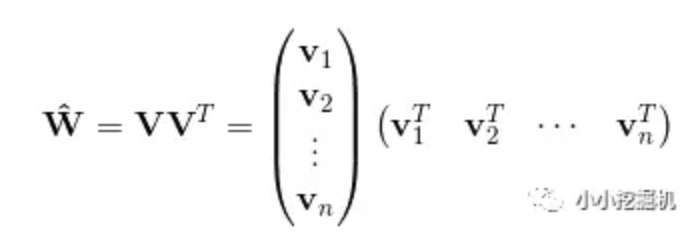
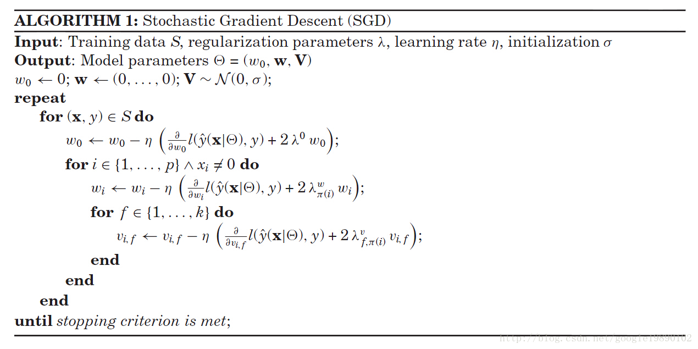

[TOC]

# FM(Factorization Machine) 模型

## 基本介绍

FM模型是一种基于矩阵分解的机器学习模型，对于稀疏数据具有很好的学习能力，解决了LR泛化能力弱的问题。

- FM 主要目标
  
  > 解决数据稀疏的情况下，特征怎样组合的问题

- FM优点
  
  > 1. 可以在非常稀疏的数据中进行合理的参数估计
  > 2. FM模型的时间复杂度是线性的
  > 3. FM是一个通用的模型，它可以用于任何特征为实值的情况

## FM算法原理

### one-hot导致稀疏性

### FM交叉项求解

在一般线性模型中，各个特征是独立考虑的，没有考虑特征与特征之间的相互关系。即一般的线性模型表达式为

$y = w_0 + \sum_{i=1}^n w_ix_i$

但实际中，大量的特征之间是有关联的，为了表述特征之间的相关性，我们采用多项式模型。在多项式模型中，特征 $x_i$ 与 $x_j$ 的组合用 $x_ix_j$表示。简单起见，我们只讨论二阶多项式

$y = w_0 + \sum_{i=1}^n w_i x_i + \sum_{i=1}^{n-1} \sum_{j=i+1}^n w_{ij} x_i x_j$

该多项式模型与线性模型相比，多了特征组合的部分，特征组合部分的参数有 $C_n^2 = \frac{n(n-1)}{2}$ 复杂度为 $n^2$。如果特征非常稀疏且维度很高的话，时间复杂度大大增加。

为了求出 $w_{ij}$，我们对每一个特征分量$x_i$ 引入辅助向量 $v_i = (v_{i1}, v_{i2}, ..., v_{ik} $ ，然后利用 $v_i v_j^T 对w_{ij}$ 进行求解

 时间复杂度将为 O(kn) 

具体过程如下

$ \sum_{i=1}^{n-1} \sum _{j=i+1}^n <v_i, v_j> x_i x_j$

$= 1/2 (\sum_{i=1}^{n} \sum_{j=1}^n <v_i, v_j> x_i x_j - \sum_{i=1}^n <v_i, v_j> x_i x_i )$

$= 1/2 (\sum_{i=1}^n \sum_{j=1}^n \sum_{f=1}^k v_{i,f} v_{j,f} x_i x_j - \sum_{i=1}^n \sum_{f=1}^i v_{i,f} v_{i,f} x_i x_i )$

$= 1/2 \sum_{f=1}^k ((\sum_{i=1}^n v_{i,f} x_i) (\sum_{j=1}^n v_{j,f} x_j) - \sum_{i=1} v_{i,f}^2 x_i^2 )$

$= 1/2 \sum_{f=1}^k ( (\sum_{i=1}^n v_{i,f} x_i)^2 - \sum_{i=1} v_{i,f}^2 x_i^2 ) $

### 基于随机梯度优化

- 损失函数和成本函数推导

[LR 损失函数推导](https://github.com/anty-zhang/machine_learning/blob/master/loss_function/loss_function.md)

$\begin{array}{l}
L(y,\widehat y) = \sum\limits_{i = 1}^m { - \log \sigma ({y^{(i)}}{{\widehat y}^{(i)}})} \\
\frac{{\partial L(y,\widehat y)}}{{\partial \theta }} =  - \frac{1}{{\sigma (y\widehat y)}}\sigma (y\widehat y)(1 - \sigma (y\widehat y))y\frac{{\partial \widehat y}}{{\partial \theta }}\\
 = (\sigma (y\widehat y) - 1)y\frac{{\partial \widehat y}}{{\partial \theta }}
\end{array}$

$\begin{array}{l}
\widehat y = {w_0} + \sum\limits_{i = 1}^n {{w_i}{x_i} + } \sum\limits_{i = 1}^{n - 1} {\sum\limits_{j = i + 1}^n {{w_{ij}}{x_i}{x_j}} } \\
 = {w_0} + \sum\limits_{i = 1}^n {{w_i}{x_i} + } 1/2\sum\limits_{f = 1}^k {((} \sum\limits_{i = 1}^n {{v_{i,f}}} {x_i}{)^2} - \sum\limits_{i = 1} {v_{i,f}^2} x_i^2)\\
L(y,\widehat y) = \sum\limits_{i = 1}^m { - \log \sigma ({y^{(i)}}{{\widehat y}^{(i)}})} \\
\frac{{\partial L(y,\widehat y)}}{{\partial \theta }} =  - \frac{1}{{\sigma (y\widehat y)}}\sigma (y\widehat y)(1 - \sigma (y\widehat y))y\frac{{\partial \widehat y}}{{\partial \theta }}\\
 = (\sigma (y\widehat y) - 1)y\frac{{\partial \widehat y}}{{\partial \theta }}\\
\\
\frac{{\partial \widehat y}}{{\partial \theta }} = \left \{ \begin{array}{l} \\
1 & if \quad \theta  = {w_0}\\
{x_i} & if \quad \theta  = {w_i}\\
{x_i}\sum\limits_{j = 1}^n {{v_{j,f}}{x_j} - {v_{i,f}} x_i^2}  & if \quad \theta  = {v_{i,f}} \\
\end{array} \right. \\
\end{array}$

- 参数更新逻辑

- 代码实现

## FM和其它算法比较

- FM VS MF
1. FM 可以更方便的加入特征，而MF 加入特征非常复杂
2. 在实际大规模数据场景下，在排序阶段，绝大多数只使用ID信息的模型是不实用的，没有引入Side Information(即除了User ID/Item ID 外很多其他有用的特征)，是不具备实战价值的。原因很简单，大多数真实应用场景中，User/Item有很多信息可用，而协同数据只是其中的一种，引入更多特征明显对于更精准地进行个性化推荐是非常有帮助的。而如果模型不支持更多特征的便捷引入，明显受限严重，很难真正实用，这也是为何矩阵分解类的方法很少看到在Ranking阶段使用，通常是作为一路召回形式存在的原因。

## reference

[FM 论文](https://www.csie.ntu.edu.tw/~b97053/paper/Rendle2010FM.pdf)

[libFM 优化算法论文](https://www.csie.ntu.edu.tw/~b97053/paper/Factorization%20Machines%20with%20libFM.pdf)

[FM(Factorization Machine)算法（推导与实现）(numpy)](https://blog.csdn.net/qq_24819773/article/details/86308868)

[FM TensorFlow实现](https://github.com/Johnson0722/CTR_Prediction/tree/master)

[tf fm 代码](https://github.com/babakx/fm_tensorflow/blob/master/fm_tensorflow.ipynb)

[CTR预估算法之FM, FFM, DeepFM及实践](https://blog.csdn.net/John_xyz/article/details/78933253)

[tensorflow实战练习，包括强化学习、推荐系统、nlp等](https://github.com/princewen/tensorflow_practice/tree/master)

[推荐系统遇上深度学习(一)--FM模型理论和实践](https://www.jianshu.com/p/152ae633fb00)

[FM算法及FFM算法((1, -1) logistic loss解释)](https://www.cnblogs.com/ljygoodgoodstudydaydayup/p/6340129.html)

[推荐系统召回四模型之：全能的FM模型](https://zhuanlan.zhihu.com/p/58160982)
