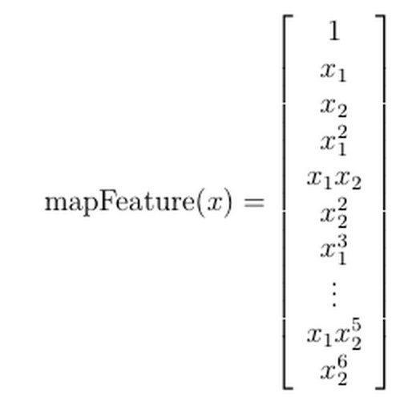

[TOC]

# 总述

> 线性模型LR: 没有考虑到特征之间关联

> LR + 多项式：特征组合，不适用于特征稀疏场景，泛化能力比较弱 

> FM： 适用于特征稀疏场景，繁华能力比较强

> FFM：省去零值特征，提升FFM模型训练和预测速度，这也是稀疏样本采用FFM的显著优势

# LR 推导

## 数学推导

LR是一种监督学习的分类算法，实现了给定数据集到0，1的映射。

数据集合： $D = {(x_1, y_1), (x_2, y_2), ..., (x_n, y_n)}$ 

$\hat y = \sigma(z) $

$\sigma(z) = \frac {1} {1 + e^{-z}}$

$z = w^Tx + b$

$p(y=1|x) = \hat y$

$p(y=0|x) = 1 - \hat y$

LR逻辑回归假设： 样本服从0-1的伯努利分布

$p(y|x;w) = \hat y ^ y * (1 - \hat y) ^ {1-y}$

对数损失函数: 最大化 $p(y|x;w)即最大化log(p(y|x;w))$

$log(p(y|x;w)) = y log(\hat y) + (1-y) log(1 - \hat y) = - L (y, \hat y)$

因此损失函数为： 即最大化 $log(p(y|x;w))$，就是最小化损失函数 $L(y, \hat y)$

$L(y, \hat y) = - y log(\hat y) - (1-y) log(1 - \hat y)$

成本函数（即m个训练样本）：假设所有样本都服从同一分布且相互独立，所有这些样本的联合概率分布，就是每个样本概率的乘积

$l(w) = \prod_{i=0}^m p(y_i|x_i; w) = \prod_{i=0}^m {\hat y ^ y * (1 - \hat y) ^ {1-y}}$

最大对数似然估计(需要寻找一组参数，使得给定的样本的观测值概率最大)

$log(l(w)) = \sum_{i=0}^m (y log(\hat y) + (1-y) log(1 - \hat y))$ 

因此，成本函数为

$J(w) = - \frac {1} {m} log(l(w)) = \frac {1} {m} \sum_{i=0}^m L(y, \hat y)$

## 问题

### 为什么不使用阶跃函数，而使用sigmod函数使z值转为0，1？

1. 阶跃函数性质不好
2. 不可导求解过于复杂

### 为什么要求最大对数似然函数而不是最大似然函数？

1. 为什么要取 -log 损失函数？因为损失函数的本质就是，如果预测对了，则不惩罚；相反预测错误，会导致损失函数变得很大。而 -log 在[0,1]之间正好符合这一点。
2. LR是广义线性回归模型，使用平方损失函数，对于sigmoid函数求导计算，不能保证是凸函数，在优化求解过程，可能是求得是局部最小值，而不是全局最小值。
3. 取完对数后，后续求解会比较方便
4. 如果根据似然函数直接计算，有两个缺点： （1）不利于后续求导  （2）似函数的计算会导致数据溢出
5. 除以m得到平均损失值，避免样本量对损失值的影响

### 逻辑回归为什么使用sigmoid

https://blog.csdn.net/u013385925/article/details/79666953

# 广义线性模型
https://www.jianshu.com/p/c99e7a2cf151 （逻辑回归（LR） 广义线性模型）

# LR如何解决线性不可分问题
https://www.jianshu.com/p/dce9f1af7bc9

## 利用核函数，对特征进行变换

把低维空间转换到高维空间，在低维空间线性不可分的数据，在高维空间线性可分的概率会大一些

### 举例

#### 举例1: 使用核函数(特征组合映射)

针对线性不可分数据集，可以尝试对给定的两个feature做一个多项式特征的映射，例如

下面两个图的对比说明了线性分类曲线和非线性分类曲线（通过特征映射）

左图是一个线性可分的数据集；右图在原始空间中线性不可分，可以利用核函数，对特征进行转换，
$例如[x_1, x_2] => [x_1, x_2, x_{11}, x_{12}, x_{22}]$

#### 举例2: LR中，在线性回归的基础上引入交叉项，来实现非线性分类

$z = \sum_{i=1}^m w_ix_i + \sum_{i=1}^{m-1} \sum_{j=i+1}^m w_{ij}x_ix_j + b$

### 优点：实现了非线性

### 缺点：组合特征泛化能力弱

> 特征的稀疏性，每个参数$w_{ij}的训练都需要大量的x_i和x_j$都非零的样本；由于特征本来就比较稀疏，满足$x_i， x_j$都非零的样本将会非常少 

> 训练样本不足，很容易导致参数$w_{ij}$不准确，最终影响模型性能 

### 为什么会特征稀疏？

在机器学习中，尤其是广告领域，特征很多时候都是分类值，对于categorical feature，通常会使用one-hot encoding转为数值型特征，转化过程会产生大量的稀疏数据。

可以这么理解：对于每一个特征，如果有m个不同的取值，经过one-hot encoding之后，会变成m 个二元特征，并且，这些特征都是互斥，每次只激活一个特征，因此数据会变得非常稀疏。

### LR为什么要对连续数值特征进行离散化？

李沐曾经说过：模型是使用离散特征还是连续特征，其实是一个“海量离散特征+简单模型” 同 “少量连续特征+复杂模型”的权衡。既可以离散化用线性模型，也可以用连续特征加深度学习。就看是喜欢折腾特征还是折腾模型了。通常来说，前者容易，而且可以n个人一起并行做，有成功经验；后者目前看很赞，能走多远还须拭目以待

> 离散特征的增加和减少都很容易，易于模型的快速迭代；

> 稀疏向量内积乘法运算速度快，计算结果方便存储，容易扩展；

> 离散化后的特征对异常数据有很强的鲁棒性：比如一个特征是年龄>30是1，否则0。如果特征没有离散化，一个异常数据“年龄300岁”会给模型造成很大的干扰；

> 逻辑回归属于广义线性模型，表达能力受限；单变量离散化为N个后，每个变量有单独的权重，相当于为模型引入了非线性，能够提升模型表达能力，加大拟合；

> 离散化后可以进行特征交叉，由M+N个变量变为M*N个变量，进一步引入非线性，提升表达能力；

> 特征离散化后，模型会更稳定，比如如果对用户年龄离散化，20-30作为一个区间，不会因为一个用户年龄长了一岁就变成一个完全不同的人。当然处于区间相邻处的样本会刚好相反，所以怎么划分区间是门学问；

> 特征离散化以后，起到了简化了逻辑回归模型的作用，降低了模型过拟合的风险。

## 扩展LR算法，提出FM算法

# FM(Factorization Machine) 模型

FM模型是一种基于矩阵分解的机器学习模型，对于稀疏数据具有很好的学习能力，解决了LR泛化能力弱的问题。

# LR和SVM的区别和联系

## 什么是参数模型(LR)与非参数模型(SVM)？

在统计学中，参数模型通常假设总体(随机变量)服从每一个分布，该分布由一些参数确定(比如正太分布由均值和方差确定)，在此基础上构建的模型称为参数模型；

非参数模型对样本总体不做任何假设，只是知道总体是一个随机变量，其分布是存在的(分布中也有可能存在参数)， 但无法知道分布的形式，更不知道分布的相关参数，只是在给定的一些样本条件下，能够依据非参数统计的方法进行推断

## LR和SVM联系
1. 都可以处理分类问题(在改进的情况下可以处理多分类问题)
2. 都可以增加不同的正则项，如L1,L2，在很多式样中，两种算法的结果很接近

## LR和SVM区别
1. 模型类别：LR属于参数模型[LR假设样本服从Bernoulli分布], SVM属于非参数模型
2. 目标函数：LR采用Logistical Loss， SVM采用Hinge loss。两个损失函数的目的都是增加对分类影响较大的数据点的权重，减少与分类无关的数据点的权重
3. 数据敏感度：LR对异常点敏感；SVM对异常点不敏感，值关心支持向量，且需要先做归一化
4. 处理方法：LR通过非线性映射，大大减少了离分类平面较远的点的权重，相对提升与分类最相关的数据点的权重；SVM只考虑支持向量，也即是和分类最相关的少数点去学习分类器。
5. 模型复杂度：LR简答、易理解、大规模线性分类时比较方便；SVM理解和优化相对来说复杂，可以处理非线性问题
6. LR能做的SVM能做，SVM能做的LR做不了

## LR和SVM如何选择？
1. 如果Feature的数量很大，跟样本数量差不多，这时候选用LR或者是Linear Kernel的SVM
2. 如果Feature的数量比较小，样本数量一般，不算大也不算小，选用SVM+Gaussian Kernel
3. 如果Feature的数量比较小，而样本数量很多，需要手工添加一些feature变成第一种情况。
